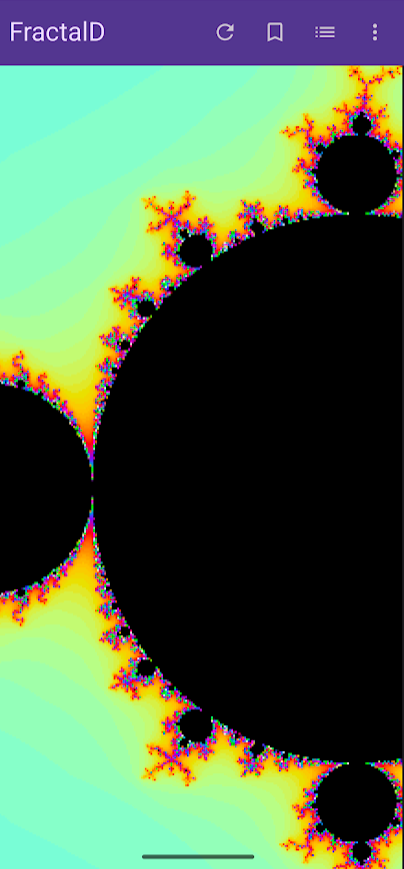
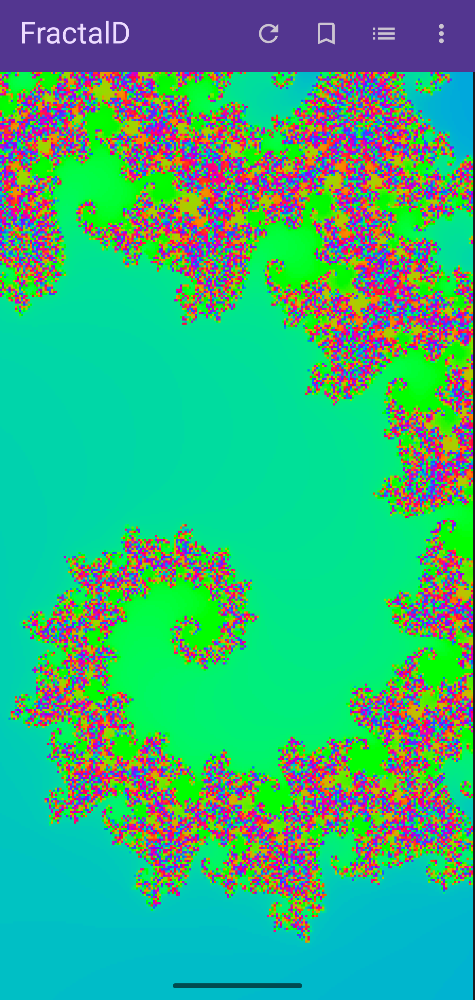
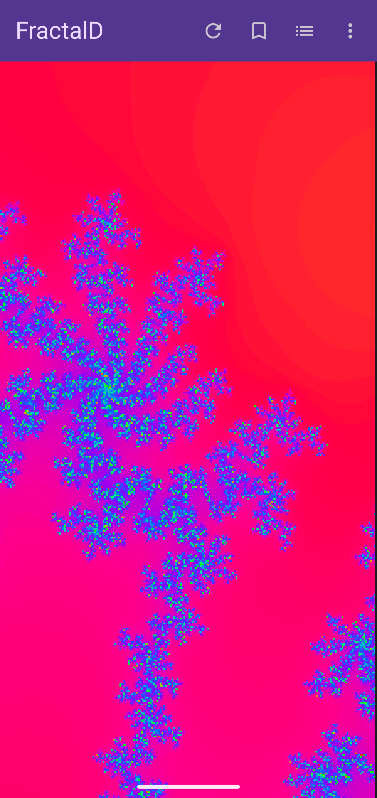
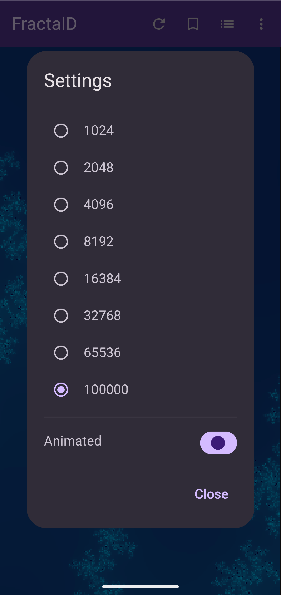
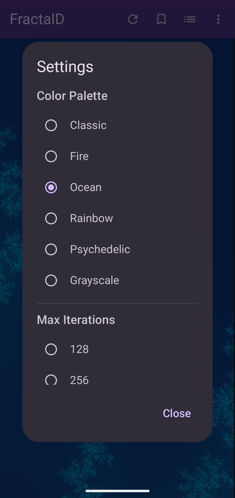
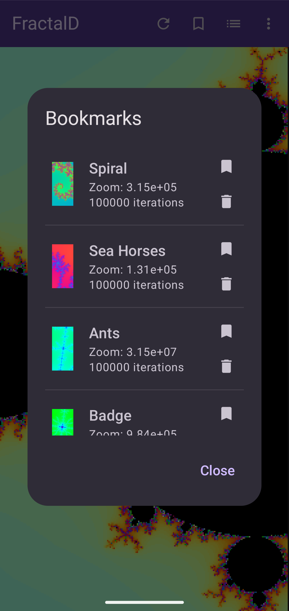

# FractalD

An interactive Mandelbrot set explorer for Android, built with Kotlin and Jetpack Compose.

## Features

### Core Functionality
- **Real-time fractal rendering** with optimized calculation algorithms
- **Interactive exploration** via touch gestures:
  - Pinch to zoom in/out
  - Pan to navigate
  - Double-tap to zoom into a point
- **Browser-like navigation** with back/forward history
- **Home button** to reset to full Mandelbrot set view

### Rendering Optimizations
- **Rectangular subdivision with border tracing** - Efficiently fills large uniform regions without calculating every pixel
- **Cardioid and bulb detection** - Mathematically detects points inside the main cardioid and period-2 bulb for instant rendering
- **Smooth escape-time coloring** - Produces smooth color gradients instead of banded iterations

### Visual Customization
- **6 color palettes**: Classic, Fire, Ocean, Rainbow, Psychedelic, Grayscale
- **Color animation** with adjustable speed
- **Play/pause toggle** directly in toolbar
- **Configurable iteration depth** (128 to 100,000 iterations)

### Bookmarks

Save and organize your favorite fractal discoveries:

- **Create bookmarks** - Tap the bookmark icon in the toolbar to save your current view
- **Automatic thumbnails** - Each bookmark generates a preview thumbnail of the fractal at that location
- **Browse saved views** - Open the bookmarks list to see all your saved locations with thumbnails
- **Quick restore** - Tap any bookmark to instantly jump back to that exact view (zoom, position, iterations, and color palette)
- **Delete bookmarks** - Remove bookmarks you no longer need from the manager
- **Persistent storage** - Bookmarks are saved in a Room database and persist across app restarts
- **Perfect for sharing** - Save interesting locations to show friends or revisit later

### Settings & Preferences

Customize your fractal exploration experience through the settings dialog:

#### Display Settings
- **Restore last view on startup** - Toggle whether the app returns to your last explored location or starts at the full Mandelbrot set
- **Current view info** - See your exact position (center coordinates and zoom level)

#### Rendering Settings
- **Max iterations** - Adjust from 128 to 100,000 iterations
  - Lower values render faster but show less detail at deep zoom levels
  - Higher values reveal intricate patterns in deep regions but take longer to calculate
  - Automatically saved with your preferences

#### Color Settings
- **Color palette** - Choose from 6 beautiful palettes:
  - **Classic** - Traditional blue/yellow Mandelbrot colors
  - **Fire** - Warm reds, oranges, and yellows
  - **Ocean** - Cool blues and greens
  - **Rainbow** - Full spectrum of colors
  - **Psychedelic** - Vibrant, high-contrast colors
  - **Grayscale** - Monochrome for a different aesthetic
- **Animation speed** - Control how fast colors cycle (if animation is enabled)
- **Play/Pause** - Toggle color animation on/off directly from the toolbar

All settings are automatically saved using DataStore and persist across app sessions.

## Technical Details

### Architecture
- **MVVM pattern** with ViewModel and Repository layers
- **Jetpack Compose** for modern declarative UI
- **Room Database** for bookmark storage
- **DataStore** for user preferences
- **Coroutines** for asynchronous computation
- **Material Design 3** theming

### Performance
- **Low-resolution rendering** with upscaling for smooth interaction
- **Debounced recalculation** during gestures (150ms delay)
- **Background computation** using Dispatchers.Default
- **Optimized algorithms** reduce calculation time by orders of magnitude for typical views

## Building

### Prerequisites
- Android Studio (latest stable version recommended)
- Android SDK API 36
- Kotlin 2.0.21

### Build Instructions

```bash
# Clone the repository
git clone https://github.com/yourusername/FractalD.git
cd FractalD

# Build debug APK
./gradlew assembleDebug

# Install on connected device
./gradlew installDebug

# Run tests
./gradlew test
```

### Project Structure
```
app/src/main/java/com/billybobbain/fractald/
├── data/               # Data models and persistence
│   ├── Bookmark.kt
│   ├── BookmarkDatabase.kt
│   ├── UserPreferences.kt
│   └── ViewState.kt
├── ui/                 # Compose UI components
│   ├── FractalDApp.kt
│   └── theme/
├── util/               # Utility classes
│   └── ThumbnailGenerator.kt
├── viewmodel/          # ViewModels
│   └── FractalViewModel.kt
├── ColorPalette.kt     # Color palette definitions
├── MainActivity.kt     # App entry point
└── MandelbrotEngine.kt # Fractal calculation engine
```

## Usage Tips

- **Double-tap** on an interesting area to zoom in quickly
- **Use bookmarks** to save and share interesting discoveries
- **Increase iterations** for deeper zoom levels to see more detail
- **Try different palettes** - each reveals different features of the set
- **Pause animation** if you want static colors for screenshots

## Mathematical Background

The Mandelbrot set is the set of complex numbers *c* for which the iterative function:

```
z(n+1) = z(n)² + c
```

does not diverge when starting from z₀ = 0. Points are colored based on how quickly they escape to infinity (or colored black if they never escape).

The set exhibits infinite complexity at all scales, revealing intricate self-similar patterns no matter how deep you zoom.

## Screenshots

### Main View


### Beautiful Fractals
<p float="left">
  
  
</p>

### Features
<p float="left">
  
  
  
</p>

*Settings, color palettes, and bookmark management*

## License

MIT License - See LICENSE file for details

## Acknowledgments

- Benoit Mandelbrot for discovering this beautiful mathematical object
- The fractal rendering community for optimization techniques
- Android developer community for Compose and modern Android development patterns
