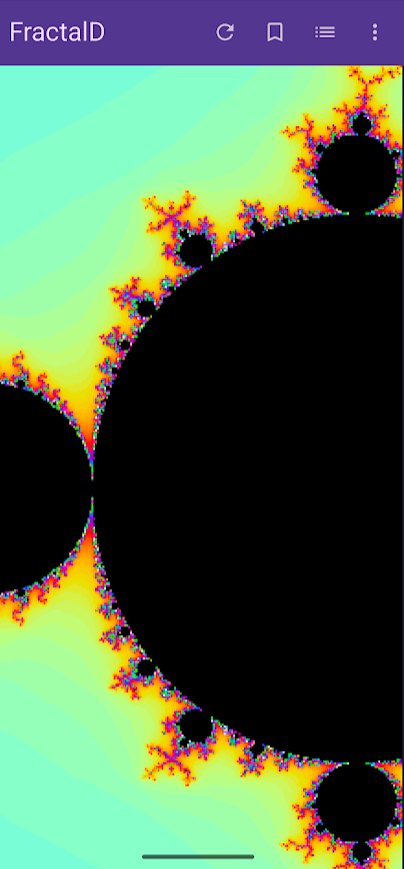
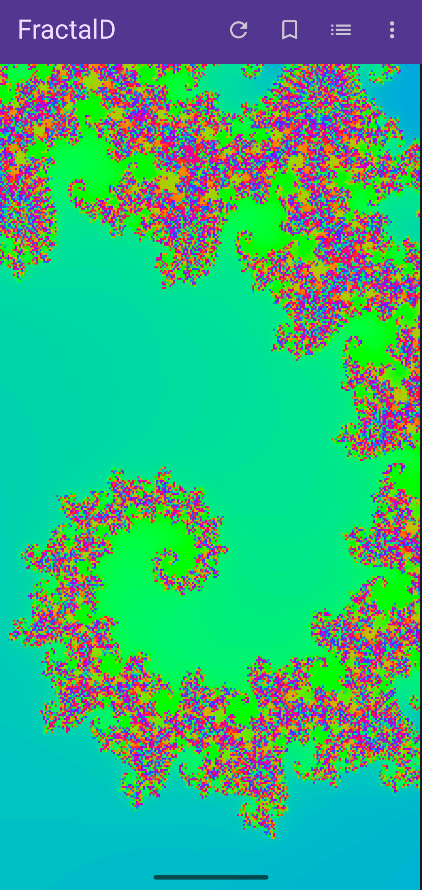
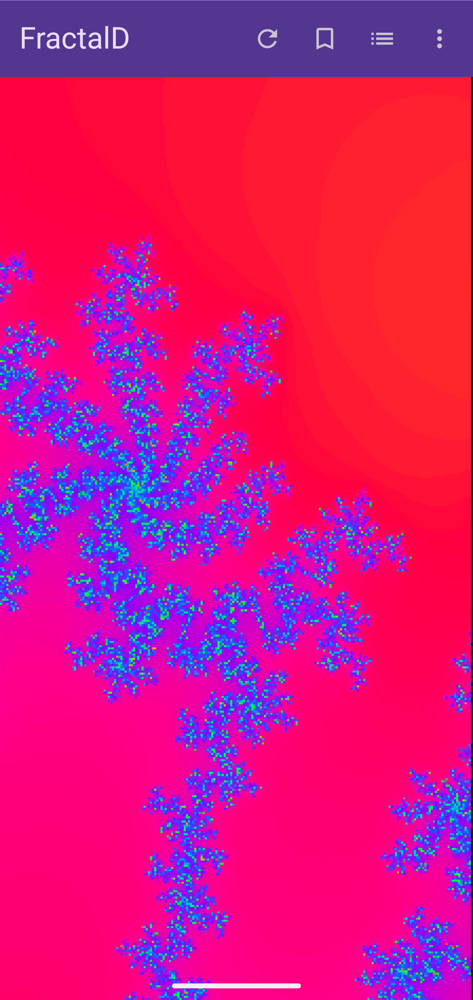
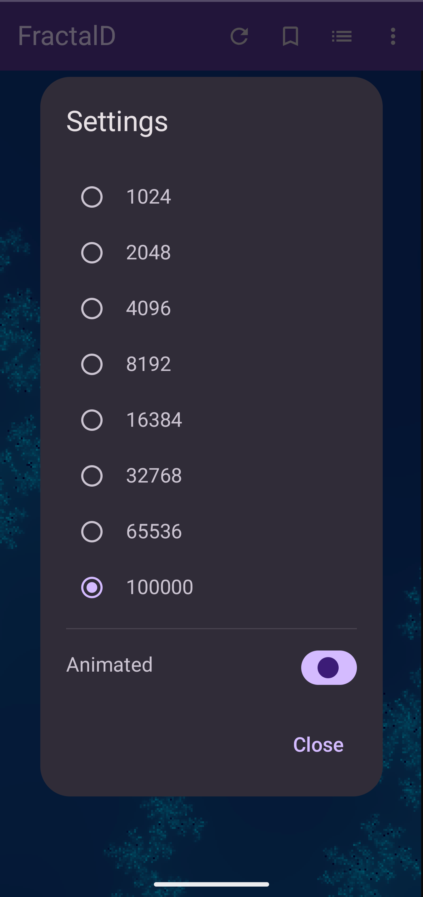
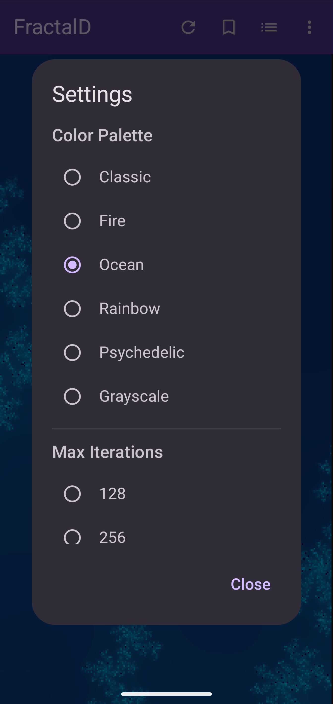
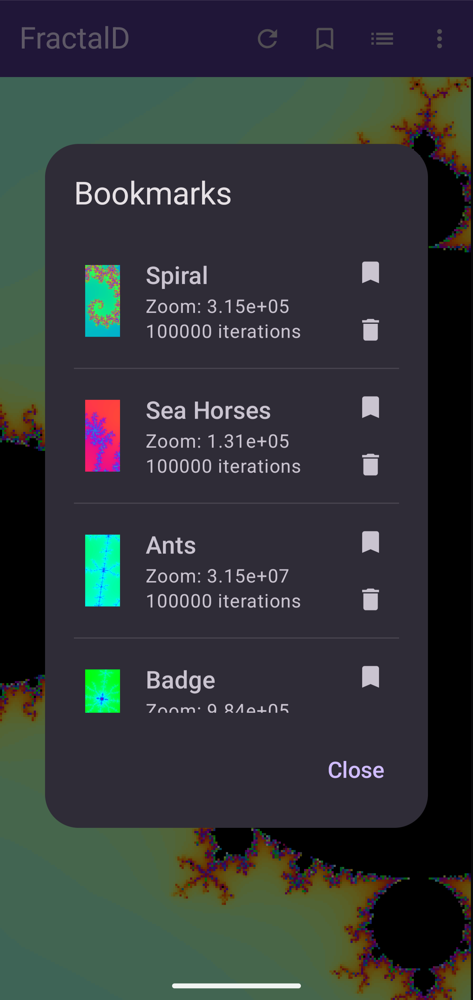

# FractalD

FractalD is an interactive fractal explorer for Android built with Kotlin and Jetpack Compose. Explore the Mandelbrot set, Julia sets, the Burning Ship, and the Tricorn with the same smooth gestures and color options.

This project started as an experiment in fractal rendering and mathematical visualization, and evolved into a full-featured explorer designed for smooth real-time navigation of the complex plane.

The goal was to combine efficient rendering techniques with a modern Android UI to make exploring fractals intuitive and fast on a mobile device.

## Fractals

FractalD supports four fractal types, each with the same view model (complex plane, zoom, pan) and color pipeline:

### Mandelbrot Set
The set of complex numbers *c* for which the iteration *z*ₙ₊₁ = *z*ₙ² + *c* (starting at *z*₀ = 0) does not escape. The classic fractal with the iconic cardioid and bulbs; infinite detail at every scale.

### Julia Set
The same iteration *z*ₙ₊₁ = *z*ₙ² + *c*, but with *c* fixed and *z*₀ varying across the plane. Each point in the Mandelbrot set corresponds to a unique Julia set. **Long-press** on the Mandelbrot view to use that point as *c* and switch to its Julia set.

### Burning Ship
Defined by *z*ₙ₊₁ = (|Re(*z*ₙ)| + i|Im(*z*ₙ)|)² + *c*. The absolute values before squaring produce a ship-like shape and different spiral structures. Same exploration model as the Mandelbrot set.

### Tricorn (Mandelbar)
Defined by *z*ₙ₊₁ = conjugate(*z*ₙ)² + *c*. The conjugate gives a three-cornered (“tricorn”) shape and symmetric, distinct patterns. Same view and controls as the other fractals.

Switch fractal type in **Settings**; your choice is saved and bookmarks store the fractal type (and, for Julia, the *c* parameter) so you can return to any view exactly.

## Features

### Core Functionality
- **Real-time fractal rendering** with optimized calculation algorithms for all supported fractals
- **Fractal type selector** in Settings (Mandelbrot, Julia, Burning Ship, Tricorn)
- **“Pick c from Mandelbrot”** – long-press on the Mandelbrot set to set the Julia parameter *c* and switch to that Julia set
- **Interactive exploration** via touch gestures:
  - Pinch to zoom in/out
  - Pan to navigate
  - Double-tap to zoom into a point
- **Browser-like navigation** with back/forward history (includes fractal type and Julia *c*)
- **Home button** to reset to the default view for the current fractal

### Rendering Optimizations
- **Rectangular subdivision with border tracing** - Efficiently fills large uniform regions without calculating every pixel
- **Cardioid and bulb detection** - Mathematically detects points inside the main cardioid and period-2 bulb for instant rendering
- **Smooth escape-time coloring** - Produces smooth color gradients instead of banded iterations

### Visual Customization
- **6 color palettes**: Classic, Fire, Ocean, Rainbow, Psychedelic, Grayscale
- **Color animation** with adjustable speed
- **Play/pause toggle** directly in toolbar
- **Configurable iteration depth** (128 to 100,000 iterations)

### Bookmarks

Save and organize your favorite fractal discoveries:

- **Create bookmarks** - Tap the bookmark icon in the toolbar to save your current view
- **Automatic thumbnails** - Each bookmark generates a preview thumbnail of the fractal at that location
- **Browse saved views** - Open the bookmarks list to see all your saved locations with thumbnails
- **Quick restore** - Tap any bookmark to instantly jump back to that exact view (fractal type, zoom, position, iterations, color palette; for Julia, the *c* parameter is also restored)
- **Delete bookmarks** - Remove bookmarks you no longer need from the manager
- **Persistent storage** - Bookmarks are saved in a Room database and persist across app restarts
- **Perfect for sharing** - Save interesting locations to show friends or revisit later

### Settings & Preferences

Customize your fractal exploration experience through the settings dialog:

#### Fractal & Display Settings
- **Fractal type** - Choose Mandelbrot, Julia, Burning Ship, or Tricorn
- **Restore last view on startup** - Toggle whether the app returns to your last explored location or starts at the default view
- **Current view info** - See your exact position (center coordinates and zoom level)

#### Rendering Settings
- **Max iterations** - Adjust from 128 to 100,000 iterations
  - Lower values render faster but show less detail at deep zoom levels
  - Higher values reveal intricate patterns in deep regions but take longer to calculate
  - Automatically saved with your preferences

#### Color Settings
- **Color palette** - Choose from 6 beautiful palettes:
  - **Classic** - Traditional blue/yellow Mandelbrot colors
  - **Fire** - Warm reds, oranges, and yellows
  - **Ocean** - Cool blues and greens
  - **Rainbow** - Full spectrum of colors
  - **Psychedelic** - Vibrant, high-contrast colors
  - **Grayscale** - Monochrome for a different aesthetic
- **Animation speed** - Control how fast colors cycle (if animation is enabled)
- **Play/Pause** - Toggle color animation on/off directly from the toolbar

All settings are automatically saved using DataStore and persist across app sessions.

## Technical Details

### Architecture
- **MVVM pattern** with ViewModel and Repository layers
- **Jetpack Compose** for modern declarative UI
- **Room Database** for bookmark storage
- **DataStore** for user preferences
- **Coroutines** for asynchronous computation
- **Material Design 3** theming

### Performance
- **Low-resolution rendering** with upscaling for smooth interaction
- **Debounced recalculation** during gestures (150ms delay)
- **Background computation** using Dispatchers.Default
- **Optimized algorithms** reduce calculation time by orders of magnitude for typical views

## Building

### Prerequisites
- Android Studio (latest stable version recommended)
- Android SDK API 36
- Kotlin 2.0.21

### Build Instructions

```bash
# Clone the repository
git clone https://github.com/yourusername/FractalD.git
cd FractalD

# Build debug APK
./gradlew assembleDebug

# Install on connected device
./gradlew installDebug

# Run tests
./gradlew test
```

### Project Structure
```
app/src/main/java/com/billybobbain/fractald/
├── data/               # Data models and persistence
│   ├── Bookmark.kt
│   ├── BookmarkDatabase.kt
│   ├── FractalType.kt   # Fractal type enum
│   ├── UserPreferences.kt
│   └── ViewState.kt
├── ui/                 # Compose UI components
│   ├── FractalDApp.kt
│   └── theme/
├── util/               # Utility classes
│   └── ThumbnailGenerator.kt
├── viewmodel/          # ViewModels
│   └── FractalViewModel.kt
├── BurningShipEngine.kt # Burning Ship fractal engine
├── ColorPalette.kt     # Color palette definitions
├── FractalEngine.kt    # Common engine interface
├── JuliaSetEngine.kt   # Julia set engine
├── MainActivity.kt     # App entry point
├── MandelbrotEngine.kt # Mandelbrot set engine
└── TricornEngine.kt    # Tricorn (Mandelbar) engine
```

## Usage Tips

- **Double-tap** on an interesting area to zoom in quickly
- **Long-press on the Mandelbrot set** to use that point as the Julia parameter *c* and switch to its Julia set
- **Use bookmarks** to save and share interesting discoveries (fractal type and Julia *c* are saved)
- **Increase iterations** for deeper zoom levels to see more detail
- **Try different palettes** - each reveals different features of the set
- **Pause animation** if you want static colors for screenshots
- **Switch fractal type** in Settings to explore Burning Ship or Tricorn from their default views

## Mathematical Background

All four fractals use the same escape-time idea: iterate a function and color by how quickly the orbit escapes (or stays bounded).

- **Mandelbrot set**: *z*ₙ₊₁ = *z*ₙ² + *c*, with *z*₀ = 0 and *c* varying over the plane. The set is the *c* for which the orbit stays bounded.
- **Julia set**: Same formula *z*ₙ₊₁ = *z*ₙ² + *c*, but *c* is fixed and *z*₀ varies over the plane. Each *c* in the Mandelbrot set corresponds to one Julia set.
- **Burning Ship**: *z*ₙ₊₁ = (|Re(*z*ₙ)| + i|Im(*z*ₙ)|)² + *c*; the absolute values before squaring change the shape entirely.
- **Tricorn**: *z*ₙ₊₁ = conjugate(*z*ₙ)² + *c*; the conjugate gives a three-lobed, symmetric set.

Points are colored by smooth escape time (how quickly the orbit exceeds a radius of 2). The sets exhibit intricate, self-similar structure at all scales.

## Screenshots

### Main View


### Beautiful Fractals
<p float="left">
  
  
</p>

### Features
<p float="left">
  
  
  
</p>

*Settings, color palettes, and bookmark management*

## License

MIT License - See LICENSE file for details

## Acknowledgments

- Benoit Mandelbrot for discovering this beautiful mathematical object
- The fractal rendering community for optimization techniques
- Android developer community for Compose and modern Android development patterns
